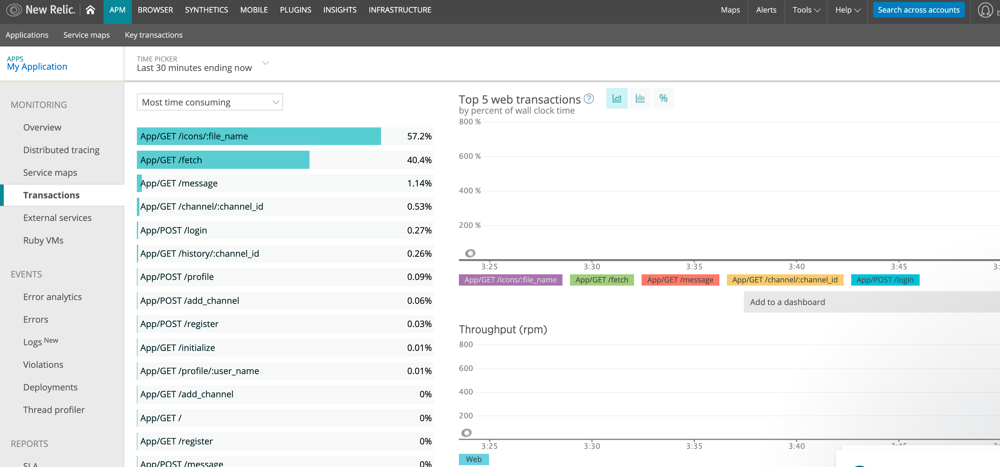

# New Relic


[New Relic | Deliver more perfect software](https://newrelic.com/)

## Ruby 実装で New Relic を使う方法
[Sinatra instrumentation | New Relic Documentation](https://docs.newrelic.com/docs/agents/ruby-agent/frameworks/sinatra-instrumentation) に書いてある。

ISUCON7 予選でやるならこんな感じである。
まず、New Relic にログインして新しく APM を作る。
`https://rpm.newrelic.com/accounts/<account-id>/applications/setup#ruby` のような URL に遷移するので、その説明にしたがって設定すれば良い。

一応書いておくと、そのページからダウンロードできる　`newrelic.yml` を `webapp/ruby/` に、置く。

`Gemfile` に

```ruby
gem 'newrelic_rpm'
```

を追加する。

`app.rb` で読み込んで、

```ruby
require 'newrelic_rpm'
```

`bundle install` する。

```bash
/home/isucon/local/ruby/bin/bundle install -j 4
```

アプリケーションを再起動する。

```bash
sudo systemctl restart isubata.ruby.service
```

New Relic のページに **Listen for my application** というボタンがあるので、ベンチを回しながらこれを押すとアプリケーションを検知してくれて、モニタリングできるようになる。



## 参考
1. [ISUCON9 予選の過去問でNew Relicを使う - valid,invalid](https://ohbarye.hatenablog.jp/entry/2020/07/22/newrelic-is-cool-for-isucon)
1. [Sinatra instrumentation | New Relic Documentation](https://docs.newrelic.com/docs/agents/ruby-agent/frameworks/sinatra-instrumentation)
